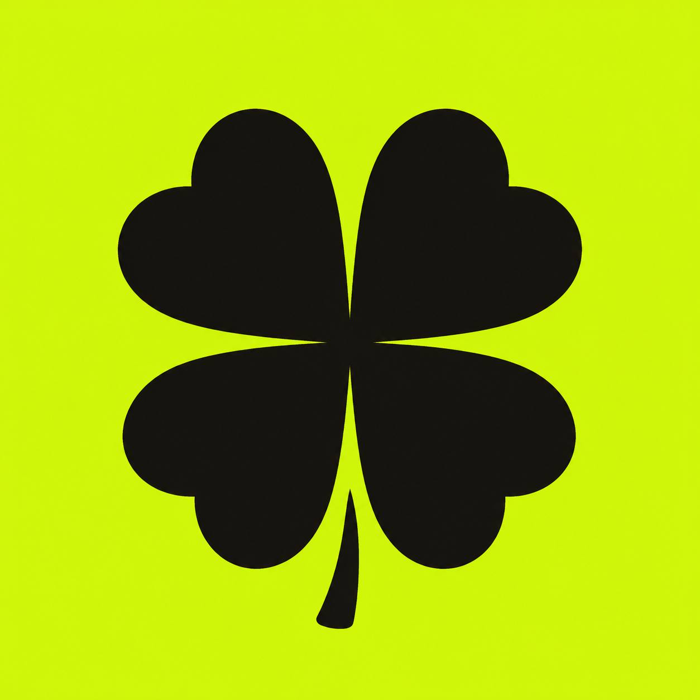

<div align="center">



# 🍀 LUCKY COIN &nbsp;·&nbsp; `$LUCKY`

### The Luckiest Coin on Robinhood

*No utility. No roadmap. No product.*
*Just the one question every winner asked before they were winners:*

# what if you got lucky?

<br/>


<br/>
<br/>

<a href="https://luckycoin.fun"></a>&nbsp;
<a href="https://luckycoin.fun#scratch"></a>
<a href="https://x.com/LuckyCoinOnRH"></a>

<br/>
<br/>

> **`CA:` coming soon — drop time TBA** &nbsp;🍀

</div>

---

## 🎰 What is this?

A single-page landing site for **`$LUCKY`**, a satirical memecoin that leans all the way into the narrative. It's built like a scratch ticket because that's exactly what it is — you're not investing, you're finding out. Robinhood-green, casino-flashy, and honest about the odds right on the front.

There is no product behind this. That's the whole bit. **The narrative *is* the coin.**

---

## ✨ Features

- 🎟️ **Interactive scratch-off ticket** — drag across the foil to reveal a random prize (`1,000×` … `A BILLY` … `LOSER`)
- 📈 **Parabolic pump chart** that draws itself on scroll
- 🔢 **Count-up "big hits"** cards and a live-style ticker strip
- 🍀 Floating clovers, radiating light-burst hero, glow everywhere
- 🃏 An honest **"rules of the ticket"** section + full risk disclaimer
- ♿ Graceful degradation — content still shows with JS off; `prefers-reduced-motion` respected

---

## ⚙️ Built With

<p align="center">
  
</p>

Plain static **HTML / CSS / JS** in a single `index.html` — no framework, no build step. Google Fonts (**Anton** · **Space Grotesk** · **Space Mono**). Deployed on **Vercel** with Web Analytics, auto-deploying from `main`.

---

## 🃏 The Rules of the Ticket

<details>
<summary><b>Read the back of the ticket 🍀</b></summary>
<br/>

> **01 · No utility. None.** No app, no staking, no "ecosystem." There is a ticker and a feeling.
>
> **02 · It's a gamble. Own that.** You're not investing. Bet what you'd be fine lighting on fire, and not a dollar past it.
>
> **03 · The narrative is the coin.** It runs on one question, asked by enough people at once. If the crowd believes long enough, the chart answers. If it doesn't, it's a candle.

</details>

---

## 🪙 "Tokenomics"

```yaml
supply:      vibes
utility:     null            # this is not a bug
roadmap:     ["what if you got lucky?"]
team:        anonymous degens
liquidity:   locked (probably)
target:      $1,000,000,000  # a billy
realism:     low
fun:         maximum
```

---

## 🚀 Run it locally

```bash
git clone https://github.com/gumballchief/lucky-coin.git
cd lucky-coin
python -m http.server 8899
# open http://localhost:8899
```

That's it. One file. No dependencies to install.

---

## ⚠️ Disclaimer

`$LUCKY` is a meme coin with **no intrinsic value, no utility, and no expectation of financial return.** Nothing here is financial, investment, legal, or tax advice. Every figure, chart, and "hit" is hypothetical and for entertainment only. Crypto is extremely high risk — **you can and likely will lose everything you put in.** Never spend more than you are fully prepared to lose. Not affiliated with Robinhood Markets, Inc.

---

<div align="center">

*this is a gamble, not a plan. that's the whole point.*

## 🍀 what if you got lucky?

<a href="https://luckycoin.fun"></a>

</div>
